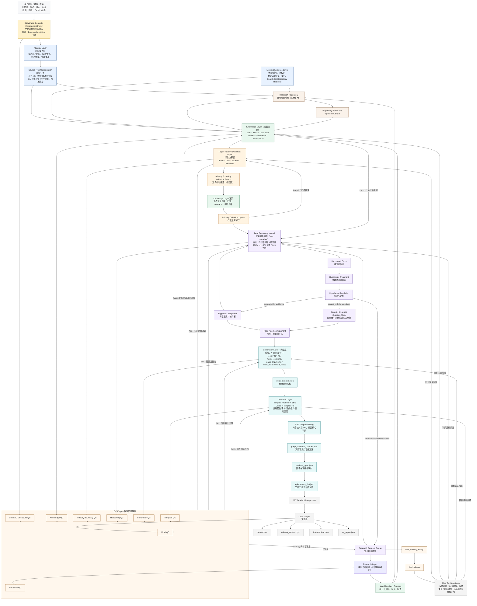

# ib-industry-section-skill 改造计划

本文是 `ib-industry-section-skill` 的项目级改造计划，不属于 runtime skill 包内容。

目标不是让 agent 读这份文档后执行客户项目，而是指导接下来几天如何改造代码、schema、workflow 与文档。实际 skill 包内应保留精简执行说明，避免 LLM 被开发计划干扰。

---

## 0. 项目背景与大原则

这个项目要解决的不是“自动生成任意 PPT”，而是一个很具体的投行工作流：

```text
用有限项目线索 + 用户材料 + 公开资料，
生成一份 pre-mandate client pitchbook 的行业 section。
```

它的交付目标是让潜在客户相信：

1. 我们理解行业；
2. 我们理解标的所处赛道；
3. 我们理解交易机会；
4. 我们知道未来买方会怎么看；
5. 我们有能力把这个故事讲成一套专业 pitchbook 页面。

因此，系统默认不是：

- CIM；
- Teaser；
- DD 清单；
- 已签约顾问工作计划；
- 普通行业研究报告；
- 面向买方的投资备忘录。

### 0.1 全局设计原则

1. **Policy first**：Pre-mandate 语境约束从第一步开始生效，不能最后再修语气。
2. **Boundary before research**：先校准行业边界，再做行业研究，避免研究错行业。
3. **Knowledge does not search**：Knowledge Layer 只沉淀事实、口径、冲突和 unknowns，不主动联网。
4. **Search is evidence collection, not judgment**：Research Layer 只补公开资料，不输出最终判断。
5. **Reasoning owns judgment**：交易判断只在 Reasoning Kernel / Issue Analysis 层发生。
6. **Hypothesis is not conclusion**：假设必须经过 resolution；未验证假设不能进入 headline 或主结论。
7. **Generation starts from page argument**：页面生成从 page argument 出发，不从 research memo 机械压缩。
8. **Template fits content, not the reverse**：模板只做适配、压缩、排版，不改变核心判断。
9. **Python owns mechanics**：编号、同步、派生 artifact、validation、渲染由脚本负责。
10. **LLM owns judgment and expression**：LLM 负责取舍、判断、表达，不手填机械字段。
11. **QC returns to the right layer**：QC 失败必须打回 Knowledge / Boundary / Research / Reasoning / Generation / Template 中的对应层。

### 0.2 改造判断标准

每个后续改动都要回答三个问题：

1. 它是否让 agent 更难把 planned search 当成 evidence？
2. 它是否让 agent 更难把 hypothesis 写成 conclusion？
3. 它是否让最终 PPT 更像 pre-mandate client pitchbook，而不是更像 JSON validation exercise？

如果答案是否定的，这个改动不应该进入主路径。

---

## 1. 真实场景

本系统服务的主场景是：

**Pre-mandate Client Pitchbook 的行业 section**

也就是：

- 尚未 pitch 下客户；
- 客户材料可能很少；
- 输入可能只有几句话、一个 PDF、一个网页链接、一份用户提供的行业报告或一个 PPT 模板；
- 系统需要基于有限材料与公开资料生成 pitchbook 行业章节；
- 核心目标不是替买方做投资判断，而是让潜在客户相信我们理解行业、标的赛道、交易机会、买方视角，并能把故事讲好。

明确不作为默认目标：

- CIM；
- Teaser；
- Due diligence 清单；
- 已签约顾问工作计划；
- 普通行业研究报告；
- 面向买方的投资备忘录。

---

## 2. 目标架构



两个核心 loop：

- 行业边界校准 loop：`Knowledge Layer → Target Industry Definition → Boundary Validation Search → Knowledge Update → Definition Update`
- 公开资料补证 loop：`Reasoning Kernel → Research Request Queue → Research Layer → New Materials → Knowledge Update → Reasoning Kernel`

---

## 3. 核心原则

1. Engagement Policy 前置约束全流程。
2. 先校准行业边界，再做行业研究。
3. Knowledge Layer 不主动搜索，只沉淀资料、事实、指标、口径、冲突和 unknowns。
4. Target Industry Definition 可以联网，但只做行业边界验证，不下行业结论。
5. Research Layer 只补公开资料。
6. Reasoning Kernel 可以提出假设和研究请求，但不能把假设写成结论。
7. Generation Layer 不是填 PPT 模板，而是把 Page Argument 转成可展示页面。
8. 具体 PPT 模板最后才介入。
9. QC Engine 横向贯穿关键产物。
10. QC 不通过要打回对应层，形成局部 loop。

---

## 4. 现有系统到目标系统的映射

| 目标层 | 当前主要文件 / 模块 | 改造方向 |
|---|---|---|
| Engagement Context / Policy | `SKILL.md`, `references/execution_discipline.md`, `templates/critical_anti_patterns.md` | 收敛成明确的 pre-mandate policy，不再混入开发计划 |
| Material Layer | `input_card.json`, `validate_input_card.py` | 增加 material index/source classification，不扩写判断 |
| Knowledge Layer | `research_evidence_db.json`, `industry_research_pack.md` | 让 `research_evidence_db.json` 成为事实 source of truth，Markdown 只是导出 |
| Target Industry Definition | `industry_scope_pack.json`, `validate_industry_scope_pack.py` | 只做行业边界、口径风险、excluded scope，不写 market conclusion |
| Boundary Validation Search | `formal_search_plan.json`, `search_log.md`, `formal_research_execution_report.json` | planned vs actual accounting 前置，禁止用 planned query 当 evidence |
| Research Layer | `append_search_attempt.py`, `source_reviews.json`, `source_archive/` | 接入 SearXNG/Manual URL/Report ingestion，所有材料回 Knowledge |
| Reasoning Kernel | `industry_issue_analysis.json`, `build_issue_analysis_skeleton.py`, `validate_issue_analysis.py` | 加强 supported/directional/hypothesis/caveat 分流 |
| Page Argument / Generation | `deck_blueprint.json`, `compile_deck_blueprint.py` | 让 LLM 做页面主编，脚本做字段映射和 evidence contract |
| Template Layer | `template_registry.json`, `extract_template_registry.py`, `render_layouts.json` | 新增 template analyzer/style guide/fit，模板只适配不改判断 |
| QC Engine | `validate_*`, `validate_stage_gate.py`, `validate_final_delivery.py` | 把错误输出统一成 repair target，并回流到对应层 |
| Output Layer | `pipeline.py`, `run_pipeline.sh`, `fill_ppt_tokens.py`, `postprocess_ppt_visuals.py` | `pipeline.py` 保持唯一正式渲染入口，shell 保持 thin wrapper |

---

## 5. 关键设计决策

### 5.1 改造计划不要放进 runtime skill 包

开发计划、架构草图、实施路线都放在 repo 级 `docs/`。

原因：

- runtime skill 包应只包含 agent 执行客户项目所需文件；
- 架构计划会让 agent 误以为这些是客户项目执行步骤；
- 之前的问题之一就是“开发文档污染 skill 上下文”。

### 5.2 只有少数文件需要 LLM 认真写

主 authoring path 应收敛为：

```text
input_card.json
research_evidence_db.json
industry_issue_analysis.json
deck_blueprint.json
```

其他文件应尽量由脚本生成、校验、修复建议：

```text
industry_research_pack.md
page_evidence_contract.json
renderer_spec.json
replacement_dict.json
validation artifacts
diagnostic reports
```

### 5.3 Planned search 与 actual search 必须分离

`formal_search_plan.json` 是 coverage map，不是 evidence。

`search_log.md` 中真实执行、打开、审阅的 S-xxx 才能进入 source review 与 evidence DB。

未执行 FS 行只能进入：

- `not_executed`
- `not_material`
- `research_backlog`
- `gap_audit`

不能进入 supported judgment、headline 或 chart metric。

### 5.4 Hypothesis Resolution 必须成为正式逻辑

`Hypothesis Store` 下游只有三种去向：

```text
Hypothesis Store
        ↓
Hypothesis Resolution
        ├── 降级为 caveat / diligence question
        ├── 转 Research Request Queue 继续公开补证
        └── 回 Reasoning Kernel 重写为可证据支持表达
```

禁止路径：

```text
Hypothesis Store → Page Argument → Headline
```

### 5.5 Template 最后介入

模板影响：

- 版式；
- 信息密度；
- 图表样式；
- 来源区；
- 字体与配色；
- 内容压缩。

模板不应改变：

- page thesis；
- judgment strength；
- evidence permission；
- hypothesis status。

---

## 6. 改造阶段

### Phase 1：清理文档与上下文污染

目标：让 runtime skill 包只包含执行客户项目需要的信息。

任务：

- 删除 runtime skill 包中的开发计划、roadmap、可跑清单；
- repo 级 `docs/` 保留项目改造计划；
- `README.md` 面向公开 GitHub 用户；
- `SKILL.md` 面向 agent 执行客户项目，精简且不包含开发路线；
- `references/` 只保留执行规则，不保留架构讨论。

验收：

- 打包后的 skill 中没有 `docs/pre_mandate_*plan*` 一类开发文档；
- agent 看到的是“怎么执行客户项目”，不是“怎么改造这个项目”。

### Phase 2：Material / Knowledge 分层

目标：把“用户材料、公开搜索、历史资料、公司材料”分清。

任务：

- 增加或扩展 source metadata：
  - `project_specific_material`
  - `user_curated_industry_report`
  - `web_search_result`
  - `company_material`
  - `repository_retrieval`
- `research_evidence_db.json` 增加 source type、access level、fact type、confidence、scope 字段；
- `industry_research_pack.md` 继续作为 DB 导出，不允许手写主路径。

验收：

- 用户丢进来的行业报告可以直接进入 Material Layer；
- 系统知道这是用户精选资料，不等同于系统搜索结果；
- 所有事实可以追溯到 source type。

### Phase 3：行业边界校准 loop

目标：防止一开始研究错行业。

任务：

- `industry_scope_pack.json` 只允许写：
  - broad industry；
  - core target industry；
  - adjacent themes；
  - excluded scope；
  - data hierarchy；
  - unvalidated leads；
  - required reconciliations。
- boundary validation search 只验证行业边界，不做完整行业研究；
- `validate_industry_scope_pack.py` 阻止 confirmed market claim；
- formal search plan skeleton 使用 full taxonomy，但区分 deep/light/accounting-only。

验收：

- 底妆不会被扩成泛美妆；
- 液压不会被扩成工程机械；
- 渠道、应用、父行业不会被误当 core target industry。

### Phase 4：Research Layer 与 planned-vs-actual accounting

目标：修复“计划搜索覆盖全 taxonomy，但实际只搜一部分却继续下游”的问题。

任务：

- `formal_search_plan.json` 增加：
  - `execution_expectation`
  - `minimum_actual_searches`
  - `coverage_required`
  - `terminal_status`
- `formal_research_execution_report.json` 增加：
  - planned FS rows；
  - actual S attempts；
  - executed with evidence；
  - not executed；
  - high priority below minimum；
  - downstream permission。
- source reviews skeleton 只从真实 search log S-xxx 生成；
- evidence DB 只承接真实 S-ID/SRC-ID。

验收：

- 不能伪造 S-011 到 S-042；
- 未执行 FS 行不能进入 evidence；
- workflow 能明确告诉 LLM：还差哪些 planned-vs-actual accounting。

### Phase 5：Reasoning Kernel 与 Hypothesis Resolution

目标：让判断发生在 issue analysis，而不是 research pack 或 deck 中偷跑。

任务：

- `industry_issue_analysis.json` 增加或强化：
  - `evidence_status`
  - `judgment_strength`
  - `allowed_deck_usage`
  - `hypothesis_resolution`
  - `buyer_relevance`
  - `pre_mandate_pitch_relevance`
- `validate_issue_analysis.py` 禁止 unsupported hypothesis 进入 headline usage；
- issue skeleton 自动生成 backlog，LLM 只写真正有判断价值的 issue analysis。

验收：

- supported judgment 才能进 page argument；
- directional 只能进 body/context；
- caveat-only 只能进 caveat/diligence question；
- not researched 不能进入 deck claim。

### Phase 6：Generation Layer 与 Page Argument

目标：PPT 不再从 research memo 压缩出来，而是从 page argument 生成。

任务：

- `deck_blueprint.json` 明确：
  - investor/client question；
  - page thesis；
  - main message；
  - body blocks；
  - visual intent；
  - source use；
  - page caveat；
  - evidence role。
- `compile_deck_blueprint.py` 做 deterministic field mapping，不改变 page thesis；
- `validate_deck_blueprint.py` 提供正确字段名、active fields、repair target。

验收：

- 页面有主编视角；
- 每页回答一个 pre-mandate client pitch 问题；
- body 不因模板字段少而变薄。

### Phase 7：Template Layer

目标：模板动态识别，最后适配。

任务：

- 新增 `template_profile.json`：
  - colors；
  - fonts；
  - layout rules；
  - chart style；
  - source style；
  - information density；
  - available components。
- 新增或扩展：
  - `template_analyzer.py`
  - `template_fit.py`
  - `template_qc`
- Template Fit 只做压缩、摆放、图表/文字分配，不改变核心判断。

验收：

- 换 PPT 模板后，不需要手工重写 mapping；
- 模板 capacity 不足时，返回 Generation Layer 修改表达，不绕过 pipeline；
- Template QC 能指出配色、字体、来源区、信息密度问题。

### Phase 8：QC Engine 横向化

目标：错误能打回对应层，LLM 不用猜。

任务：

- 将 QC 输出统一为：
  - `issue_type`
  - `severity`
  - `repair_target_layer`
  - `repair_target_artifact`
  - `recommended_action`
  - `forbidden_action`
- 覆盖：
  - Knowledge QC；
  - Industry Boundary QC；
  - Research QC；
  - Reasoning QC；
  - Generation QC；
  - Template QC；
  - Final QC。

验收：

- content quality 失败不会只吐 80 个错误；
- workflow next 能说明应该修 DB、issue analysis、deck blueprint、template fit 还是 source review；
- final_delivery=false 时不能被 agent 表述成“完成”。

### Phase 9：External Evidence Connector

目标：支持低成本搜索与用户手动资料。

任务：

- Search Connector 设计：
  - SearXNG first；
  - Bing/SerpAPI/Tavily/Exa future optional；
  - Manual URL ingestion；
  - Report ingestion；
  - Market Data MCP future；
  - Filing/announcement connector future；
  - Internal research repository。
- `web_search.py` provider 化；
- search result 与 source archive 自动建立 trace。

验收：

- 没有 paid search API 时仍可通过 SearXNG 或 manual URL 运行；
- 用户丢进来的 PDF/report 可以成为正式来源；
- 搜索结果、摘录、原文定位、source review 能自动串起来。

---

## 7. 最终主流程

改造完成后的主流程应该是：

```text
1. Brief Intake
   input_card.json

2. Material / Knowledge Workspace
   source metadata
   research_evidence_db.json
   industry_research_pack.md（generated export）

3. Industry Boundary
   industry_scope_pack.json
   boundary validation search

4. Formal Research
   formal_search_plan.json
   search_log.md
   source_reviews.json
   source_archive/
   formal_research_execution_report.json

5. Banker Judgment
   industry_issue_analysis.json

6. Page Design
   deck_blueprint.json

7. Template Fit + Deterministic Delivery
   template_profile.json
   page_evidence_contract.json
   renderer_spec.json
   replacement_dict.json
   PPT + final validation
```

LLM 认真写的文件应尽量只有：

```text
input_card.json
research_evidence_db.json
industry_issue_analysis.json
deck_blueprint.json
```

脚本负责：

```text
IDs
source mapping
archive
execution accounting
research pack export
page evidence contract
renderer spec
replacement dict
validation
PPT rendering
final delivery
```

---

## 8. Plugin 化判断

暂时不要先做 plugin。

先完成：

- workflow 主路径稳定；
- planned-vs-actual search accounting 稳定；
- hypothesis resolution 稳定；
- template layer 成型；
- final delivery 能稳定跑通至少一个真实案例。

之后再考虑 plugin 化：

- plugin 用于包装 orchestrator、connectors、template analyzer、repository；
- skill 继续作为 agent-facing 执行说明；
- plugin 不应替代核心 workflow 设计。

---

## 9. 当前立即要做的第一步

第一步不是继续加功能，而是整理上下文：

1. repo 级 `docs/` 保留本改造计划；
2. runtime skill 包中删除开发计划文档；
3. 检查打包逻辑，确保 packaged skill 不包含 repo 级 docs；
4. 然后开始 Phase 1：清理 `SKILL.md`、`references/`、`workflow.py next` 的上下文污染。

---

## 10. 断点续作执行清单

这一节是给断断续续执行用的。每次恢复工作时先看这里，不要重新解释整个架构。

状态标记：

- `[ ]` 未开始
- `[~]` 进行中
- `[x]` 完成
- `[!]` 阻塞，需要先记录原因再继续

每次开始工作前先跑：

```bash
cd /Users/htlh/Desktop/用所选项目新建的文件夹/ib-industry-section-skill
git status --short
```

每次结束工作前至少跑：

```bash
python3 -m py_compile runtime/ib-industry-section-skill/scripts/*.py
python3 runtime/ib-industry-section-skill/scripts/check_json_files.py --root runtime/ib-industry-section-skill/templates
python3 runtime/ib-industry-section-skill/scripts/check_artifact_manifest.py --manifest runtime/ib-industry-section-skill/templates/artifact_manifest.json
git status --short
```

### 10.1 Phase 1：清理上下文污染

状态：`[~]`

目标：开发计划留在 repo 级 `docs/`，runtime skill 包只保留 agent 执行客户项目所需内容。

需要检查/修改：

- `[x]` 新建 repo 级 `docs/pre_mandate_client_pitch_reform_plan.md`
- `[x]` 删除 runtime skill 包里的开发计划 docs
- `[x]` 新增 repo 级 `AGENTS.md`
- `[x]` 在 runtime `SKILL.md` 加极简 Operating Principles
- `[ ]` 检查打包脚本，确认 `docs/` 不进入 clean skill zip
- `[ ]` 检查 `README.md` 是否仍面向 GitHub 用户，而不是本地路径说明
- `[ ]` 检查 `references/` 中是否有开发路线/架构讨论残留

重点文件：

```text
AGENTS.md
README.md
docs/pre_mandate_client_pitch_reform_plan.md
runtime/ib-industry-section-skill/SKILL.md
runtime/ib-industry-section-skill/references/*.md
```

完成标准：

- packaged skill 中没有 repo 级改造计划；
- runtime `SKILL.md` 不超过必要长度；
- agent 看到的是“如何执行客户项目”，不是“如何改造项目”。

### 10.2 Phase 2：Material / Source Classification

状态：`[ ]`

目标：用户材料、用户精选行业报告、系统搜索结果、历史资料、市场数据分清楚。

需要设计：

- `[ ]` source type enum
- `[ ]` material index 或 source metadata 结构
- `[ ]` 用户上传报告 / URL / PDF 的进入路径
- `[ ]` source type 写入 `source_reviews.json`
- `[ ]` source type 写入 `research_evidence_db.json`

重点文件：

```text
runtime/ib-industry-section-skill/templates/source_reviews.template.json
runtime/ib-industry-section-skill/scripts/build_source_reviews_skeleton.py
runtime/ib-industry-section-skill/scripts/validate_source_reviews.py
runtime/ib-industry-section-skill/scripts/research_evidence_db.py
runtime/ib-industry-section-skill/scripts/build_research_evidence_db.py
```

完成标准：

- 用户提供的行业报告不会被误标成系统搜索；
- 每个 evidence row 能追溯 source type；
- Knowledge Layer 能区分 user-provided、public-search、repository-retrieved。

### 10.3 Phase 3：Industry Boundary Loop

状态：`[ ]`

目标：先定义行业边界，再正式研究；boundary search 只验证“研究哪个行业”。

需要修改：

- `[ ]` `industry_scope_pack` schema 明确 broad/core/adjacent/excluded
- `[ ]` `validate_industry_scope_pack.py` 阻止 confirmed market claim
- `[ ]` boundary validation search 与 formal research search 在字段上区分
- `[ ]` formal search plan skeleton 明确 taxonomy 是 coverage audit

重点文件：

```text
runtime/ib-industry-section-skill/templates/industry_scope_pack_schema.json
runtime/ib-industry-section-skill/templates/industry_scope_pack.template.json
runtime/ib-industry-section-skill/scripts/validate_industry_scope_pack.py
runtime/ib-industry-section-skill/scripts/build_formal_search_plan_skeleton.py
runtime/ib-industry-section-skill/references/scope_boundary.md
```

完成标准：

- scope pack 里数字只能作为 unvalidated lead；
- boundary validation 不产生 page-ready conclusion；
- workflow 文案明确：industry boundary search 不是 formal research。

### 10.4 Phase 4：Formal Research Planned-vs-Actual Accounting

状态：`[ ]`

目标：彻底封住“FS rows 写满但实际没搜也继续下游”的路径。

需要修改：

- `[ ]` `formal_search_plan` 增 `execution_expectation`
- `[ ]` `formal_search_plan` 增 `minimum_actual_searches`
- `[ ]` `formal_research_execution_report` 增 `coverage_summary`
- `[ ]` `formal_research_execution_report` 标注每个 FS row 的 terminal status
- `[ ]` `workflow.py next` 在 planned-vs-actual 不完整时给明确 repair target
- `[ ]` source reviews 只允许引用真实 executed/reviewed S-ID

重点文件：

```text
runtime/ib-industry-section-skill/templates/formal_search_plan_schema.json
runtime/ib-industry-section-skill/scripts/build_formal_search_plan_skeleton.py
runtime/ib-industry-section-skill/scripts/validate_formal_search_plan.py
runtime/ib-industry-section-skill/templates/formal_research_execution_report_schema.json
runtime/ib-industry-section-skill/scripts/build_formal_research_execution_report_skeleton.py
runtime/ib-industry-section-skill/scripts/validate_formal_research_execution.py
runtime/ib-industry-section-skill/scripts/workflow.py
runtime/ib-industry-section-skill/scripts/validate_run_state.py
```

完成标准：

- planned FS row 不能被当作 actual S attempt；
- 未执行 FS row 自动进入 `not_executed/not_material/research_backlog`；
- evidence DB 不接收没有 S-ID/SRC-ID 的 claim。

### 10.5 Phase 5：Reasoning Kernel / Hypothesis Resolution

状态：`[ ]`

目标：让 hypothesis 进入可控分流，不再混进结论。

需要修改：

- `[ ]` issue analysis schema 增 `evidence_status`
- `[ ]` issue analysis schema 增 `allowed_deck_usage`
- `[ ]` issue analysis schema 增 `hypothesis_resolution`
- `[ ]` validator 禁止 `not_researched/caveat_only` 进入 headline/main message
- `[ ]` issue skeleton 自动生成 backlog，减少 LLM 手填机械字段

重点文件：

```text
runtime/ib-industry-section-skill/templates/issue_analysis_schema.json
runtime/ib-industry-section-skill/scripts/build_issue_analysis_skeleton.py
runtime/ib-industry-section-skill/scripts/validate_issue_analysis.py
runtime/ib-industry-section-skill/scripts/normalize_issue_analysis.py
runtime/ib-industry-section-skill/skills/research-pack/SKILL.md
```

完成标准：

- supported 才能进入 headline/main message；
- directional 只能进入 body/context；
- caveat_only 只能进入 caveat/diligence question；
- not_researched 不能进入 deck claim。

### 10.6 Phase 6：Generation Layer / Page Argument

状态：`[ ]`

目标：deck 从 page argument 生成，不从 research pack 机械压缩。

需要修改：

- `[ ]` `deck_blueprint` 明确 page thesis、main message、visual intent、evidence role
- `[ ]` `validate_deck_blueprint.py` 报错时列出 active fields 和 repair target
- `[ ]` `compile_deck_blueprint.py` 保留 LLM 的 target_field intent，不盲按顺序塞字段
- `[ ]` `page_evidence_contract` 继承 evidence status 和 downstream permission

重点文件：

```text
runtime/ib-industry-section-skill/templates/deck_blueprint_schema.json
runtime/ib-industry-section-skill/scripts/validate_deck_blueprint.py
runtime/ib-industry-section-skill/scripts/compile_deck_blueprint.py
runtime/ib-industry-section-skill/scripts/build_page_evidence_contract.py
runtime/ib-industry-section-skill/scripts/validate_page_evidence_contract.py
runtime/ib-industry-section-skill/skills/deck-blueprint-section/SKILL.md
```

完成标准：

- 每页能说明 page argument；
- body block 到模板字段不靠顺序猜；
- deck 不会因为模板字段少而丢掉核心判断。

### 10.7 Phase 7：Template Layer

状态：`[ ]`

目标：动态识别 PPT 模板并做 template fit。

需要新增/修改：

- `[ ]` `template_profile.json` schema 或结构
- `[ ]` `template_analyzer.py`
- `[ ]` `template_fit.py`
- `[ ]` Template QC 输出配色、字体、版式、来源区、信息密度问题
- `[ ]` renderer / postprocess 使用 template profile，而不是散落配置

重点文件：

```text
runtime/ib-industry-section-skill/scripts/extract_template_registry.py
runtime/ib-industry-section-skill/scripts/validate_template_registry.py
runtime/ib-industry-section-skill/scripts/template_contract_utils.py
runtime/ib-industry-section-skill/scripts/layout_config.py
runtime/ib-industry-section-skill/templates/render_layouts.json
runtime/ib-industry-section-skill/templates/layout_config.json
runtime/ib-industry-section-skill/scripts/postprocess_ppt_visuals.py
```

完成标准：

- 换模板后能重新分析 style/capacity；
- template fit 不改变核心判断；
- 模板容量不足会回 Generation，而不是绕过 pipeline。

### 10.8 Phase 8：QC Engine / Repair Targets

状态：`[ ]`

目标：所有关键失败都能告诉 LLM “修哪层、哪个文件、不能做什么”。

需要修改：

- `[ ]` 统一 QC 输出字段：`issue_type/severity/repair_target_layer/repair_target_artifact/recommended_action/forbidden_action`
- `[ ]` `validate_content_quality.py` 的分类输出继续拆清楚
- `[ ]` `validate_stage_gate.py` 和 `validate_final_delivery.py` 读取/汇总 repair targets
- `[ ]` `workflow.py next` 输出唯一下一步命令

重点文件：

```text
runtime/ib-industry-section-skill/scripts/validate_content_quality.py
runtime/ib-industry-section-skill/scripts/validate_stage_gate.py
runtime/ib-industry-section-skill/scripts/validate_final_delivery.py
runtime/ib-industry-section-skill/scripts/generate_run_quality_summary.py
runtime/ib-industry-section-skill/scripts/workflow.py
runtime/ib-industry-section-skill/scripts/validate_run_state.py
```

完成标准：

- agent 不需要猜是修 research DB、issue analysis、deck blueprint 还是 template；
- final_delivery=false 时不允许总结为完成；
- 大错误列表能聚合成少数 repair targets。

### 10.9 Phase 9：External Evidence Connector

状态：`[ ]`

目标：支持 SearXNG、manual URL/PDF、repository retrieval，减少 paid search 依赖。

需要修改：

- `[ ]` `web_search.py` provider 化
- `[ ]` 增 SearXNG connector 配置
- `[ ]` manual URL / PDF ingestion 接入 source review skeleton
- `[ ]` source archive 能保存用户资料摘录和 locator
- `[ ]` repository retrieval 进入 Knowledge Layer，而不是直接进入 deck

重点文件：

```text
runtime/ib-industry-section-skill/scripts/web_search.py
runtime/ib-industry-section-skill/scripts/append_search_attempt.py
runtime/ib-industry-section-skill/scripts/build_source_reviews_skeleton.py
runtime/ib-industry-section-skill/scripts/build_source_archive.py
runtime/ib-industry-section-skill/scripts/validate_source_archive.py
```

完成标准：

- 没有 Tavily/Bing 等付费 API 时仍可用 SearXNG 或手动资料；
- 用户给的 PDF/report 可以成为正式 evidence source；
- 所有外部证据都回到 Knowledge Layer。

### 10.10 最终回归

状态：`[ ]`

每个阶段完成后至少跑：

```bash
python3 -m py_compile runtime/ib-industry-section-skill/scripts/*.py
python3 runtime/ib-industry-section-skill/scripts/check_json_files.py --root runtime/ib-industry-section-skill/templates
python3 runtime/ib-industry-section-skill/scripts/check_artifact_manifest.py --manifest runtime/ib-industry-section-skill/templates/artifact_manifest.json
python3 runtime/ib-industry-section-skill/scripts/check_registry_coverage.py
```

最终还要跑：

```bash
PYTHON_CMD=python3 tests/run_contract_tests.sh
PYTHON_CMD=python3 tests/run_smoke_tests.sh
```

并补至少一个 minimal regression fixture：

```text
tests/fixtures/minimal_research_db/
tests/test_research_db_regression.py
tests/test_workflow_next.py
tests/test_pipeline_run_flags.py
```
